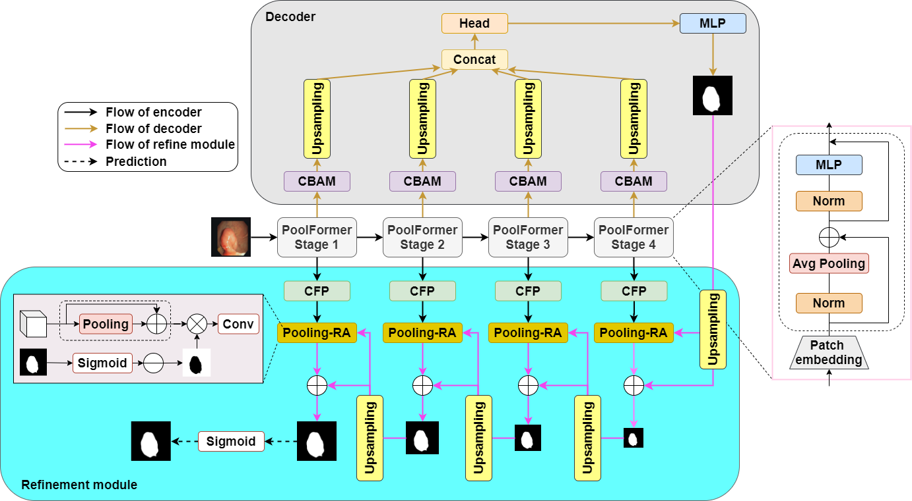

# PolyPooling: An Accurate Polyp Segmentation from Colonoscopy Images
> **Authors:** 
> Hoang Long Nguyen, 
> Dinh Cong Nguyen

This repository contains the official Pytorch implementation of training & evaluation code for PolyPooling.

## Overview



## Environment

- Requirement `CUDA 11.1` and `pytorch 1.7.1`

### Dataset

Downloading necessary data:

- Download testing dataset and move it into `./data/TestDataset/`, which can be found in this [download link (Google Drive)](https://drive.google.com/file/d/1o8OfBvYE6K-EpDyvzsmMPndnUMwb540R/view).
- Download training dataset and move it into `./data/TrainDataset/`, which can be found in this [download link (Google Drive)](https://drive.google.com/file/d/1lODorfB33jbd-im-qrtUgWnZXxB94F55/view).

### Results


### Citation

Please cite our paper if you find the work useful: 
```
@article{NGUYEN2024105979,
title = {PolyPooling: An accurate polyp segmentation from colonoscopy images},
journal = {Biomedical Signal Processing and Control},
volume = {92},
pages = {105979},
year = {2024},
issn = {1746-8094},
doi = {https://doi.org/10.1016/j.bspc.2024.105979},
url = {https://www.sciencedirect.com/science/article/pii/S1746809424000375},
author = {Dinh Cong Nguyen and Hoang Long Nguyen}
}
```
